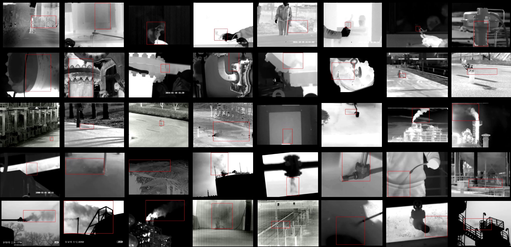

## Insubstantial Object Detection

[[PROJECT PAGE]](https://calayzhou.github.io/) [[PAPER Download]](https://arxiv.org/abs/2206.11459) [[PPT]](./readme/IOD-Video.pdf)

>Pytorch implementation for CVPR 2022 paper "Explore Spatio-temporal Aggregation for Insubstantial Object Detection: Benchmark Dataset and Baseline".


<div align="center" style="width:image width px;">
  
  
  
</div>

We endeavor on a rarely explored task named Insubstantial Object Detection (IOD), which aims to localize the object with following characteristics：
```
(1) amorphous shape with indistinct boundary;
(2) similarity to surroundings;
(3) absence in color;
```
## IOD-Video dataset

Accordingly, it is far more challenging to distinguish insubstantial objects in a single static frame and the collaborative representation of spatial and temporal information is crucial. Thus, we construct an IOD-Video dataset comprised of 600 videos (141,017 frames) covering various distances, sizes, visibility, and scenes captured by different spectral ranges.
You can preview the IOD-Video Dataset with [NJU Box](https://box.nju.edu.cn/d/654f74926166482fa569/) and download it from [dataset pages](https://calayzhou.github.io/2022/05/04/Dataset/). 

<div align="center" style="width:image width px;">
  
</div>

## Usage

### 1.Installation

For the basic usage, You can simply install the following dependencies:
```bash
conda create -n IOD python=3.9
conda activate IOD
conda install pytorch=1.8 torchvision cudatoolkit -c pytorch
pip install -r pip-list.txt
```
Please refer to [Installation.md](./readme/Installation.md) for more information.

### 2.Dataset
Download `Frames.zip` and `PKL_Annotations.zip` to the `data` folder as
```bash
IOD-Video
|------data
|         |------TLGDM
|                   |------TrueLeakedGas.pkl
|                   |------TrueLeakedGas_ACT1.pkl
|                   |------TrueLeakedGas_c1_290.pkl
|                   |------TrueLeakedGas_v1_310.pkl
|                   |------Frames
|                              |------TrueLeakedGas
|                                         |------001_wild_dynamic_vague
|                                         |------...
```
Please refer to [Dataset.md](./readme/Dataset.md) for more information.


### 3.Visualization

Download [TEA_STA_K8S3_model_last.pth](https://drive.google.com/file/d/1jMWSMgeQYzQO9LW5Dc7pLEC8IXzhUXDL/view?usp=sharing) to `./src_IOD/experiment/result_model/TEA_STA_K8S3/TEA_STA_K8S3_model_last.pth` and then run

```bash
cd src_IOD/vis
python3 vis_det.py  --vname 001_wild_static_vague.avi 
```
Please refer to [Visualization.md](./readme/Visualization.md) for more information.

### 4.Evaluation
Download models from [Google Drive](https://drive.google.com/drive/folders/1n1VG_nWj5e57iKeJlVOJgs74lQe7q7hn?usp=sharing),
[Baidu Cloud,(code:`buac`)](https://pan.baidu.com/s/1ddV-u5RXnAsKtM8f19W7DA )  and put them to the 
right places. For example, put [TEA_STA_K8S1_model_last.pth](https://drive.google.com/file/d/1SndXxRKm9qwDWmcvwI_cxbWbgoa6JP1o/view?usp=sharing) to `./src_IOD/experiment/result_model/TEA_STA_K8S1/TEA_STA_K8S1_model_last.pth` and run

~~~bash
#inference
python3 det.py --task normal --K 8  --gpus 0,1  --batch_size 20 --master_batch 10  --num_workers 2 --rgb_model ../experiment/result_model/TEA_STA_K8S1/TEA_STA_K8S1_model_last.pth  --inference_dir ../result/inference_TLGDM_pkl1   --dataset IODVideo   --split  1  --arch TEAresnet_50
#@0.5 mAP
python3 ACT.py --pkl_ACT 1 --task frameAP --K 8   --th 0.5 --inference_dir ../result/inference_TLGDM_pkl1 --dataset IODVideo --split 1
#@0.5 @0.75 @vague @clear @0.5-0.95mAP
bash ACT_total1.sh 8 1
~~~

Please refer to [Evaluation.md](./readme/Evaluation.md) for more information.

### 5.Train
You can train K=8 with TEA+STAloss as
```bash
python3 train.py --K 8 --exp_id Train_K8_Imagenet_TLGDM_STA_S1 --rgb_model ../experiment/result_model/TEA_STA_K8S1/ --batch_size 16  --master_batch 8  --lr 5e-4 --gpus 0,1 --num_workers 4  --num_epochs 12 --lr_step 6,8 --dataset IODVideo --split 1  --arch TEAresnet_50   --pretrain_model imagenet
```

Please refer to [Train.md](./readme/Train.md) for more information.

## Acknowledgement

Part of the code is adapted from previous works: [MOC](https://github.com/MCG-NJU/MOC-Detector/tree/master),
[CenterNet](https://github.com/xingyizhou/CenterNet) (code base), [ACT](https://github.com/vkalogeiton/caffe/tree/act-detector) (evaluation), 
[I3D, S3D, TAM](https://github.com/IBM/action-recognition-pytorch),
[MSNet](https://github.com/arunos728/MotionSqueeze),
[TSM](https://github.com/mit-han-lab/temporal-shift-module),
[TEA](https://github.com/Phoenix1327/tea-action-recognition),
[TIN](https://github.com/deepcs233/TIN),
[TDN](https://github.com/MCG-NJU/TDN) (backbone), thanks for their awesome repos.


## Citation

```
@inproceedings{IOD-Video-CVPR2022,
title     = {Explore Spatio-temporal Aggregation for Insubstantial Object Detection: Benchmark Dataset and Baseline},
author    = {Zhou, Kailai and Wang, Yibo and Lv, Tao and Li, Yunqian and Chen, Linsen and Shen, Qiu and Cao, Xun},
booktitle = CVPR,
year      = {2022}
}
```
